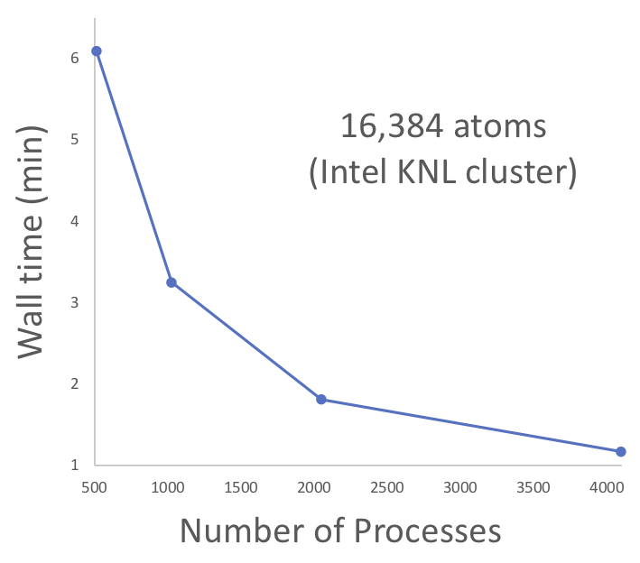

# PGAS-FMO Proxy Application 

### Background 

In high performance computing (HPC), proxy applications (“proxy apps”) are small, simplified codes that allow application developers to share important features of large applications without forcing collaborators to assimilate large and complex code bases. 
This proxy app models the Fragment Molecular Orbital (FMO) method in Quantum Chemistry. 
FMO can compute very large systems with thousands of atoms using ab initio wave functions by first subdividing a system into smaller parts or fragments. 
The total energy is then expanded as a series in the fragments starting with the monomers, then the dimers, and so on. 
This approach derives its efficiency from the neglect of inter-fragment exchange (‘nearsightedness’ principle) – an approximation managed by careful extension of the series and other model factors. 
A key strategy in the HPC implementation of FMO is the use of a parallel global address space (PGAS) scheme to distribute and access the data on the fragments over the compute nodes. 
Thus, to the end-user this proxy provides insights into both the FMO method and the implementation of PGAS concepts. 
Real FMO applications are highly complex and the present app aims to be the simplest possible representation for the purposes of performance analysis.

### Algorithm

This proxy computes the electron-repulsion term of the monomer potential at the Hartree-Fock level, incorporating the medium- and long-range approximations to the coulomb interaction.
For the present purposes, higher terms (dimers, etc) merely act to redefine the number and size of fragments and are therefore algorithmically similar to that of the monomers. 
The monomer term loops over the fragments assigned to a given compute process, then over all fragments to compute the contribution to the local Fock matrix. 
The density matrix of each remote fragment is obtained via a 'GET' operation to its location in the PGAS.
The PGAS implementation employs 'data-server' processes to simulate the one-sided GET with regular two-sided message passing. 
In the compute kernel, electron repulsion integrals over gaussian-type orbitals (GTO) located on different atomic centers are computed and contracted with elements of the density matrix before being summed to elements of the local fragment Fock matrix. 
Within the integral calculations the gaussian-product factors are tested to avoid small terms. 

### Model

The compute load is simulated using a cluster of helium-like atoms.
Each atom hosts a single function - or 'orbital' - occupied by a pair of opposite-spin electrons.
Each orbital is contracted over a set of s-type GTOs, comprising the fragment basis set. 
The compute load can be varied through the number and positioning of the atoms, together with the number of GTOs, as described in more detail below. 

### Variables

In order to simulate different compute loads, the following are variable- 
* The number of fragments (input, called 'nfrag' in the code).
* The fragment basis set, number of GTOs (input, 'ngauss' in the code). 
Determines the per-fragment compute load. 
* The (input) gaussian exponents and contraction coefficients. 
This amounts to a specification of the 'basis set' for the fragments. 
* Molecular geometry (input). 
The cartesian coordinates of each fragment/atom are input in conventional angstrom units. 
The relative positioning of atoms varies the compute load via integral screening where a closer spacing increases the overall cost.  
* The screening cutoff ('dtol', can be varied by editing the code). 
The cutoff affects both the compute load and the energy with coarser screening (larger value) causing more terms to be skipped giving a lower overall cost but a less accurate energy, and vice versa. 
* The number of fragments per compute rank. 

### Current Test Set Input Choices

In most inputs the helium atoms are arranged on a regular 3D grid. 
Most inputs have a basis set of ten GTOs per fragment, a cutoff for the medium-range coulomb approximation set to 3 Angstroms, and that for the long-range 'point charge' approximation set to 6 Angstroms. 

### Software Overview 

Software language: Fortran (90)

The essential algorithm is relatively small (about <600 lines, with comments) and each run mode will be captured in a separate code, for clarity.

| Proxy App Version          | Description  | 
|  :-:        |     :-:                |
| pgas-fmo.f90     | MPI parallel version  | 

## Build instructions

| Code                       | Dependencies  | 
|  :-:        |     :-:                |
| pgas-fmo.f90     | Fortran 90+ compiler, MPI library  | 
 

In the root dir, 

$ mkdir bin 

$ make 

### Specific build examples 
 
MPI parallel version, with compiler-wrapper

$ mpifort pgas-fmo.f90

MPI parallel version, with MPI library

$ gfortran pgas-fmo.f90 -L[path to MPI lib] -I[path to mpif.h] 

## Run Examples (see ./tests) 

Please note there is no sequential version. 

MPI version

$ mpirun -n 2 ./a.out < he2

Please note that the number of MPI ranks must be even. 

## Figure-of-Merit (FOM)

Sample performance data with various hardware and execution modes (default optimization levels). 
Please note that the proxy codes have NOT been hand-optimized for any particular platform/hardware/vendor at this time. 

#### MPI parallelism on KNL cluster (ALCF "Theta" platform) 

 

## Regression Tests 

| Atoms       | Energy  |  File  |
|  :-:        |     :-: |  :-:   |
| 1     | 3.772532  |  he  |
| 2     | 10.270951  |  he2  |
| 4     | 29.407903  |  he4  |
 

